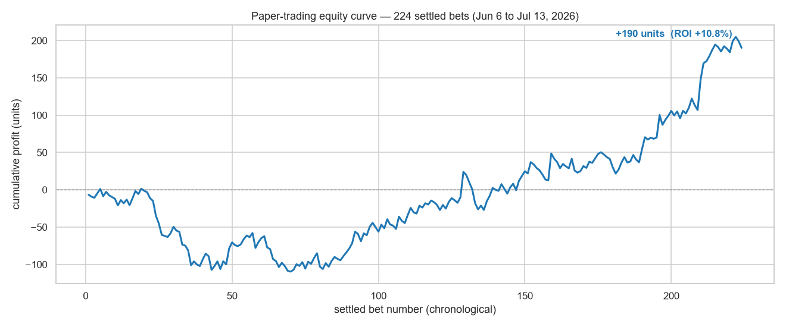
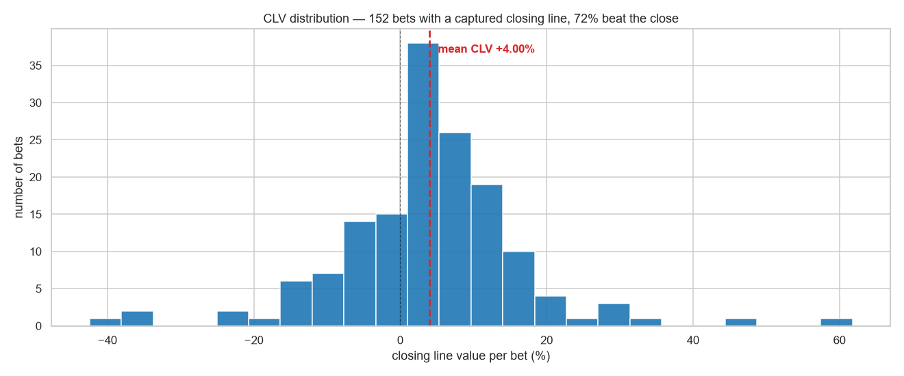

# Value Betting Scanner

> Machine learning could not beat the bookmaker. So this project stops predicting, and starts shopping for prices instead.


In [football-prediction-ml](https://github.com/zakariae-boui/football-prediction-ml), I trained Random Forest, XGBoost, and SVM on 6,080 matches with 62 leakage-safe features. The models reached the market's accuracy ceiling (about 54%) and still lost money: the closing line already prices everything public data knows. That result points somewhere interesting. If Pinnacle's closing line is the best forecast available, don't fight it. Treat it as the truth, and look for recreational bookmakers whose prices disagree with it.

That is what this scanner does. It never predicts a winner. It de-vigs the sharp book's odds into a "true" probability, then flags any soft bookmaker paying more than the fair price. Every flagged bet is logged to a paper-trading ledger (no real money) and later graded against the closing line, because closing line value (CLV) is the only honest proof of an edge.

## Results after 5 weeks of paper trading

| Metric | Value |
|---|---|
| Settled bets | 224 (Jun 6 to Jul 13, 2026) |
| ROI | **+10.8%** (+190 units on 1,757 staked) |
| Average CLV | **+4.00%** over 152 captured closing lines |
| Bets that beat the close | 71.7% |
| Average EV at placement | +4.2% |

<p align="center">
  
</p>

<p align="center">
  
</p>

The number that matters is not the ROI. Over 224 bets, +10.8% ROI still carries a lot of variance, and more than half the sample comes from a single tournament (the 2026 World Cup). The number that matters is the **+4.00% average CLV**: on average, every price taken was 4% better than where the sharpest market in the world closed. ROI fluctuates; consistently beating the close is the statistical signature of a real edge. This is exactly the metric the ML project failed to move (its CLV was slightly negative), which is what makes the two results a matched pair: **prediction does not produce an edge, price shopping does.**

## How it works

```
1. Pull live odds for every event from every bookmaker.       (odds_api.py)
2. De-vig PINNACLE's odds -> "true" probability.              (devig.py)
3. For every soft book and outcome:  EV = soft_odds x true_prob - 1
4. If EV >= 2% (and the sanity filters pass), log a paper bet
   staked with quarter Kelly.                                 (scanner.py, ledger.py)
5. Near kickoff, capture Pinnacle's closing price -> CLV.
6. After the match, settle the bet from the final score.      (run.py, daemon.py)
```

De-vigging uses the **power method** (solve k so that the raw implied probabilities to the power k sum to 1), which handles the favorite-longshot bias better than simple normalization.

**Sanity filters** stop the classic traps that make naive EV scanners look profitable on paper and useless in practice:

| Filter | Why |
|---|---|
| EV capped at 15% | a "too good to be true" edge is almost always a stale line that vanished |
| Odds capped at 6.0 | de-vig is unreliable on longshots (favorite-longshot bias) |
| At least 2 soft books above fair price | broad agreement means a slow market, one outlier means a stale quote |
| Hard stake cap on short odds | Kelly over-bets short prices (risk 20 to win 2) |

## Usage

```bash
pip install -r requirements.txt
```

Get a free API key at [the-odds-api.com](https://the-odds-api.com) and expose it as an environment variable (it is never stored in the repo):

```powershell
$env:THE_ODDS_API_KEY = "your_key"
```

Then the daily loop:

```powershell
python run.py sports          # what is in season right now
python run.py scan            # show current +EV opportunities (read-only)
python run.py scan --place    # ...and log them to the paper ledger
python run.py upcoming        # open bets sorted by kickoff, with what to do next
python run.py closeall        # near kickoff: capture closing lines -> CLV
python run.py autosettle      # after matches: settle from final scores
python run.py report          # ROI, CLV, bankroll, full history
```

Or let the daemon do all of it, timed to each kickoff:

```powershell
python daemon.py
```

There is also a web dashboard (`python dashboard.py`, then localhost:5000) with an overview page (KPIs, verdict, bankroll chart), a filterable bet list, and analytics broken down by sport, bookmaker, EV bucket, and odds band. `wsgi.py` deploys it to PythonAnywhere.

The full ledger behind the results above is included as [`paper_bets.csv`](paper_bets.csv), so every number in this README can be recomputed from the raw bets.

## Files

| File | Role |
|---|---|
| `config.py` | every knob: sports, sharp book, EV threshold, staking, filters |
| `devig.py` | margin removal: multiplicative + power methods |
| `odds_api.py` | The Odds API client |
| `scanner.py` | the EV engine + Kelly staking |
| `ledger.py` | paper bankroll: place, close, settle, stats |
| `run.py` | CLI: scan, report, closeall, autosettle, ... |
| `daemon.py` | hands-free runner timed to each kickoff |
| `dashboard.py` | Flask dashboard (Overview / Bets / Analytics) |
| `paper_bets.csv` | the actual ledger: 238 logged bets |

## Honest limits

- **This is paper trading, on purpose.** The point is to prove an edge exists with evidence (positive CLV over hundreds of bets) before anyone considers risking money.
- Soft bookmakers limit or ban accounts that consistently beat the close. The edge is real but not indefinitely scalable.
- The sample is 5 weeks and World Cup heavy. The CLV signal is strong, but a longer, more diverse sample (regular league seasons) is the next test.
- Realistic ROI expectation for this strategy is 2 to 6% long term, not the +10.8% of this early sample.

## The two-project story

| | [football-prediction-ml](https://github.com/zakariae-boui/football-prediction-ml) | value-betting-scanner (this repo) |
|---|---|---|
| Approach | predict outcomes with ML | trust the sharp price, scan for mispricing |
| Signal source | 62 features from public data | disagreement between bookmakers |
| ROI | -2.9% (best model) | +10.8% |
| Avg CLV | about 0 or negative | **+4.00%** |
| Conclusion | markets are efficient against public data | the edge is in prices, not predictions |

## Author

**Zakariae Boui** ([GitHub](https://github.com/zakariae-boui))

## License

MIT, see [LICENSE](LICENSE). Educational project: paper trading only, no real money, and nothing here is betting advice.
